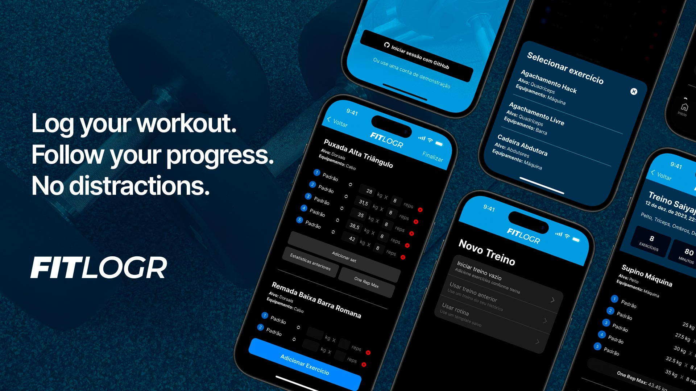

# FitLogr



FitLogr is an application project to log and manage workout data to keep traking of your fitness journey. The front-end was built using React with Next.js and Tailwind CSS.

On back-end, FitLogr uses a custom API developed using Java with Spring Framework and MySQL/MariaDB. For more information about the back end, visit the FitLogr [API repository](https://github.com/matheusmisumoto/workout-logger-api).

Learn more (in Portuguese): https://matheusmisumoto.dev/portfolio/fitlogr-workout-tracking-web-app.html

## Dependencies
- Axios
- JWT-Decode

## Project structure

- `/src/app`: app routes and screens
- `/src/components`: reusable UI pieces
- `/src/dictionaries`: translation files
- `/src/lib`: interfaces, utilitary functions and core code related to API and authentication token.

## Development environment

To run this project you will need:
- Java 17 with Spring Framework (API)
- MySQL / MariaDB database (API)
- React / Next.js

## Installing and running

You must have the [FitLog API](https://github.com/matheusmisumoto/workout-logger-api) running on your environment and a registered [GitHub OAuth App](https://github.com/settings/developers) in order to make the application work.

Change environment variables `NEXT_PUBLIC_GITHUB_CLIENT_ID` and `NEXT_PUBLIC_FITLOGR_API_URL` on .env.production or create a new .env file with your configuration.

With the API running, you can run the development server using:

```bash
npm run dev
# or
yarn dev
# or
pnpm dev
# or
bun dev
```

Open [http://localhost:3000](http://localhost:3000) with your browser to navigate on FitLog web app.

This project uses [`next/font`](https://nextjs.org/docs/basic-features/font-optimization) to automatically optimize and load Inter, a custom Google Font.